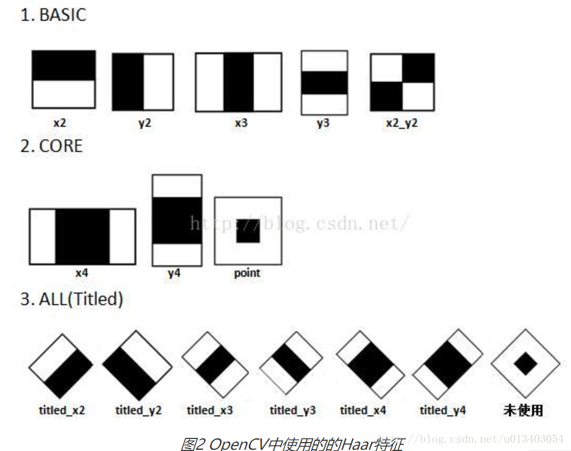
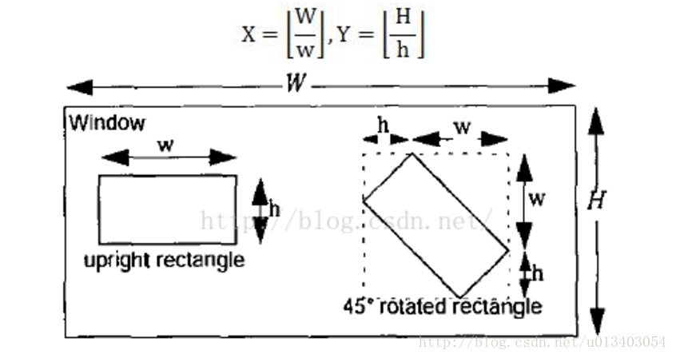
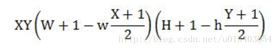
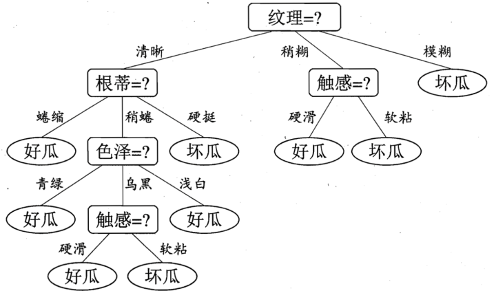
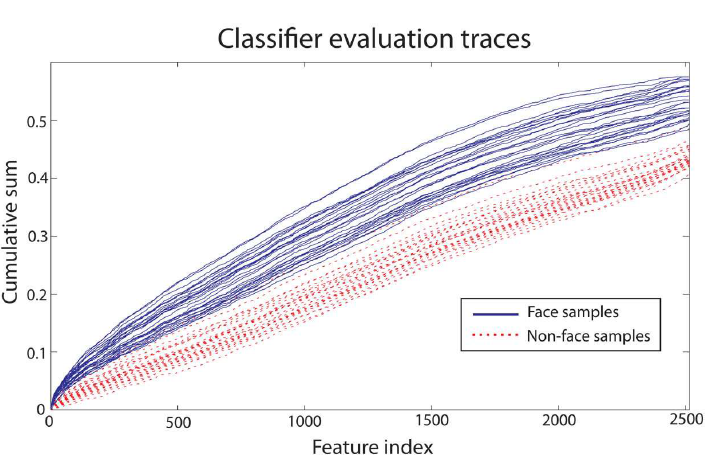
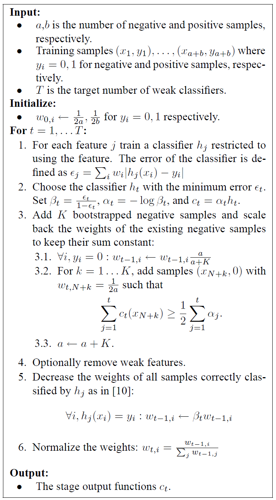
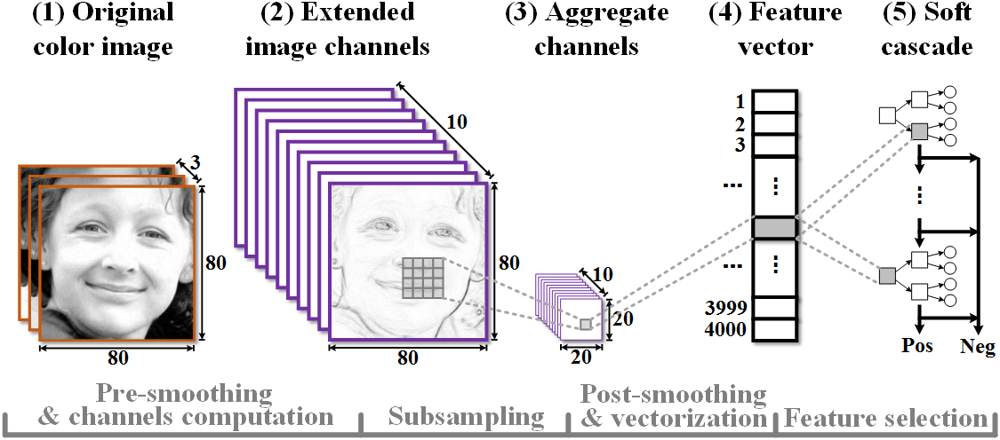

<!-- TOC -->

- [1. Haar特征](#1-haar特征)
- [2. 决策树](#2-决策树)
    - [2.1. ID3算法](#21-id3算法)
        - [2.1.1. ，信息熵(Entropy)](#211-信息熵entropy)
        - [2.1.2. 、信息增益(Information gain)](#212-信息增益information-gain)
    - [2.2. C4.5算法](#22-c45算法)
    - [2.3. CART算法](#23-cart算法)
        - [2.3.1. **连续值的处理**](#231-连续值的处理)
        - [2.3.2. **CART算法的回归问题**](#232-cart算法的回归问题)
- [决策树减枝](#决策树减枝)
- [Soft cascade结构](#soft-cascade结构)
    - [算法构想](#算法构想)
    - [算法校准](#算法校准)
- [ACF特征](#acf特征)
- [支持向量机](#支持向量机)
    - [函数间隔](#函数间隔)
    - [最大间隔问题定义](#最大间隔问题定义)
    - [对偶算法](#对偶算法)
    - [软间隔最大化](#软间隔最大化)
    - [合页损失函数](#合页损失函数)
- [非线性支持向量机](#非线性支持向量机)
    - [核函数](#核函数)
    - [常用核函数](#常用核函数)
- [序列最小最优化算法](#序列最小最优化算法)
    - [变量的选择](#变量的选择)
- [提升方法](#提升方法)

<!-- /TOC -->
# 1. Haar特征
Haar特征最先由Paul Viola等人提出，后经过Rainer Lienhart等扩展引入45°倾斜特征。Haar特征分为三类：边缘特征、线性特征、中心特征和对角线特征，组合成特征模板。它的计算是白色区域像素和减去黑色区域的像素和。总共分为以下几类：

Haar特征总个数的计算:
假设检测窗口大小为W * H，矩形特征大小为w*h，X和Y为表示矩形特征在水平和垂直方向的能放大的最大比例系数：

则总共可以获得的子特征数目为：

# 2. 决策树
决策树（decision tree）是一个树结构（**可以是二叉树或非二叉树**）。

其每个非叶节点表示一个**特征属性**上的测试，每个分支代表这个特征属性在某个值域上的输出，而每个叶节点存放一个**类别**。

构造决策树的关键步骤是分裂属性。所谓分裂属性就是在某个节点处按照某一特征属性的不同划分构造不同的分支，其目标是让各个分裂子集尽可能地“纯”。尽可能“纯”就是尽量让一个分裂子集中待分类项属于同一类别。分裂属性分为三种不同的情况：

      1、属性是离散值且不要求生成二叉决策树。此时用属性的每一个划分作为一个分支。

      2、属性是离散值且要求生成二叉决策树。此时使用属性划分的一个子集进行测试，按照“属于此子集”和“不属于此子集”分成两个分支。

      3、属性是连续值。此时确定一个值作为分裂点split_point，按照>split_point和<=split_point生成两个分支。

属性选择度量算法有很多，一般使用自顶向下递归分治法，并采用不回溯的贪心策略。这里介绍ID3和C4.5两种常用算法。
## 2.1. ID3算法
ID3算法是由Quinlan首先提出的，该算法是以信息论为基础，以信息熵和信息增益为衡量标准，从而实现对数据的归纳分类。
### 2.1.1. ，信息熵(Entropy)
熵的概念主要是指信息的混乱程度，变量的不确定性越大，熵的值也就越大，熵的公式可以表示为：

$$
Entropy(S)=-\sum_{i=1}^{m}p(u_i)log_2u_i
$$

其中,$p(u_i)=\frac{|u_i|}{|S|}$,表示类别$u_i$在S中出现的概率。

### 2.1.2. 、信息增益(Information gain)
信息增益指的是划分前后熵的变化，可以用下面的公式表示：

$$
infoGain(S,A)=Entropy(S)-\sum_{V \in Value(A)}\frac{|S_V|}{|S|}Entropy(S_V)
$$

其中，$A$表示样本的属性，$Value(A)$是属性$A$所有的取值集合。$V$是$A$的其中一个属性值，$S_V$是$S$中$A$的值为$V$的样例集合。

ID3算法，计算所有属性划分的信息增益，然后选择信息增益最大的属性，上面为了简便，将特征属性离散化了。对于特征属性为连续值，可以如此使用ID3算法：

   先将S中元素按照特征属性排序，则每两个相邻元素的中间点可以看做潜在分裂点，从第一个潜在分裂点开始，分裂S并计算两个集合的期望信息，具有最小期望信息的点称为这个属性的最佳分裂点，其信息期望作为此属性的信息期望。
   
## 2.2. C4.5算法
这次我们每次进行选取特征属性的时候，不再使用ID3算法的信息增益，**而是使用了信息增益率这个概念。**

首先我们来看信息增益率的公式：

$$
Gain\_ratio(D,A)=\frac{Gain(D,A)}{IV(A)}
$$

**由上图我们可以看出，信息增益率=信息增益/IV(A),说明信息增益率是信息增益除了一个属性A的固有值得来的。**

原因是,信息增益准则其实是对可取值数目较多的属性有所偏好！（**比如上面提到的编号，可能取值是实例个数，最多了，分的类别越多，分到每一个子结点，子结点的纯度也就越可能大，因为数量少了嘛，可能在一个类的可能性就最大**）。
我们来看IV(a)的公式：

属性a的固有值：

$$
IV(A)=-\sum_{v=1}^{V}\frac{|D_v|}{|D|}log_2\frac{|D_v|}{|D|}
$$

由上面的计算例子，可以看出IV(A)其实能够反映出，当选取该属性，分成的V类别数越大，IV(A)就越大，如果仅仅只用信息增益来选择属性的话，那么我们偏向于选择分成子节点类别大的那个特征。

于是C4.5算法不直接选择增益率最大的候选划分属性，候选划分属性中找出信息增益高于平均水平的属性（_**这样保证了大部分好的的特征**_），再从中选择增益率最高的。

## 2.3. CART算法
CART(Classification And Regression Tree)，分类与回归树算法使用基尼系数来代替信息增益比，基尼系数代表了模型的不纯度，基尼系数越小，则不纯度越低，特征越好。
分类问题中，假设有K个类别，第k个类别的概率为pk。则基尼系数的表达式为：

$$
Gini(p)=\sum_{k=1}^{K}p_k(1-p_k)=1-\sum_{k=1}^{K}p_k^2
$$

CART分类树算法每次仅仅对某个特征的值进行二分，**建立的是二叉树，运算效率更快**，并且基尼系数是**平方计算，比对数计算更快。**

### 2.3.1. **连续值的处理**
同样划分，唯一的区别在于在选择划分点时的度量方式不同，C4.5使用的是信息增益比，则CART分类树使用的是基尼系数。

**CART分类树对于多离散值的处理问题**，采用的思路是不停的二分离散特征，类似多分类问题，比如某特征有A1.A2.A3三种取值，则CART可能分成A1,(A2,A3)，然后A2,A3在下一层继续二分，总之，CART树是一个二叉树模型。

### 2.3.2. **CART算法的回归问题**
CART回归树预测回归连续型数据，假设X与Y分别是输入和输出变量，并且Y是连续变量。在训练数据集所在的输入空间中，递归的将每个区域划分为两个子区域并决定每个子区域上的输出值，构建二叉决策树。

$$
D=\{(x_1,y_1),(x_2,y_2),(x_3,y_3),\ldots(x_n,y_n)\}
$$

**选择最优切分变量j与切分点s**：遍历变量j，对规定的切分变量j扫描切分点s，选择使下式得到最小值时的(j,s)对。

$$min_{j,s}[min_{c_1}\sum_{x \in R_{1(j,s)}}(y_i-c_1)^2+min_{c_2}\sum_{x \in R_{2(j,s)}}(y_i-c_2)^2]$$

其中$R_m$是被划分的输入空间，$c_m$是空间$R_m$对应的固定输出值。
$$
R_1(j,s)=\{x|x^{(j)} \leq s\} , R_2(j,s)=\{x|x^{(j)} > s\} \\
c_m=\frac{1}{N_m}\sum_{x_i \in R_m(j,s)}y_i
$$
继续对两个子区域重复前面的步骤，直至满足停止条件。
将输入空间划分为M个区域R1,R2,…,RM，生成决策树：

$$f(x)=\sum_{m=1}^{M}c_mI(x \in R)$$

# 决策树减枝
# Soft cascade结构
为改进VJ框架的缺点而提出，总结的VJ框架缺点:
1. 后一阶段的stage没法利用前一阶段stage的信息。
2. 对于每一级stage，要达到预定的检测率和误报率，越到后面，需要越多的样本和弱分类器。
3. 每一个stage的目标参数，对于检测速度的影响是间接的，如果平衡检测速度和精度，只能不断微调参数，然后重新训练，很浪费时间。
4. 和3类似，其它的自由变量,stage数量等，都和检测速度没有明显关系。

## 算法构想
类似VJ框架，但是我们不使用多个级联的stage,而是用单个的stage，它由很长的T个弱分类器构成，这个分类器的输出定义为：

$$
H(x)=\sum_{t=1}^{T}c_t(x)
$$
其中$c_t(x)=\alpha_th_t(x)$,和VJ框架中每个弱分类器的输出相同。我们根据feature数量的多少，绘制出$H(x)$的函数图如下:

可见，随着feature的增加，这个分类器是可以区分开人脸和非人脸的。VJ框架是预设了一个阈值$r_t$,如果当前阶段的$H(x)$值大于$r_t$的人脸比例大于检测率，而非人脸大于$r_t$的比例小于误检率，就结束了这个stage。

知道这一原理后，我们可以替换为以下过程。对于每一个弱分类器设定一个阈值$r_t$,在计算完输出后，如果累计值$H(x)$小于阈值，我们就输出非人脸，否则继续计算。如果通过了所有的T个分类器，这就是人脸图片。

对于每个弱分类器（stage）的输出值$c_t(x)$的训练过程如下：

和VJ框架的过程很类似，但是把负样本的添加放在了每个弱分类器之后。然后，第4步的移除条件是，如果移除后错误率下降了，那么就移除这个弱分类器。   
## 算法校准
只要确定了目标检测率D和执行时间S就能确定soft cascade的相关参数，这个过程叫做分类校准。
 
# ACF特征
目的：为了解决多角度人脸问题。
channel feature:将原始图片映射为梯度图或者方向梯度直方图，再在这些图的基础上提取特征。一个channel表示一个这样的映射关系。
ACF特征的计算流程大致如下:

分类方法：1，将VJ框架中的只有根节点的决策树，改为深度为2的决策树。2，使用soft cascade结构取代VJ框架中的多个级联stage。
# 支持向量机
支持向量机将输入空间转换到特征空间，然后在特征空间进行学习。学习的目标是一个特征空间超平面$wx +b=0$,类比之前的感知机，这样的超平面是无限多的，支持向量机限制学习到的超平面是间隔最大的，这样的平面唯一。要间隔最大，那么我们需要间隔的度量，主要有函数间隔和几何间隔。
## 函数间隔
在超平面$wx +b =0$确定的情况下，任一点$x_i$到平面的距离可以用$|wx_i+b|$表示，这里假设$x_i$在超平面的投影是$x_0$,与超片面垂直的向量投影是$x_t$,那么:
$$
\begin{aligned}
    |wx_i+b| &= |wx_0+b+wx_t| \\
             &= |0+wx_t| \\
             &=|wx_t|
\end{aligned}
$$
又因为分类结果y能够表示分类正确与否，所以这个距离可以用$y(wx+b)$表示,那么函数距离可定义为:
$$
\hat{\gamma_i}=y_i(wx_i+b)
$$
只有函数间隔，还不够，引入如果按比例的更改w和b为2w,2b,超平面本身没有改变，但是函数距离却会变为2倍，所以我们需要添加一些限制，比如规范化$|w|=1$,这就是几何间隔:
$$
\gamma_i=y_i(\frac{wx_i}{|w|}+\frac{b}{|w|})
$$
##　最大间隔问题定义
那么在训练集合中求取最大间隔平面的问题，等价于求取:
$$
\begin{aligned}
&max(\gamma) \\
&y_i(\frac{wx_i}{|w|}+\frac{b}{|w|}) \ge \gamma ,i=1,2,\dots,n
\end{aligned}
$$
这个$\gamma$表示训练集中几何间隔的最小值,根据几何间隔和函数间隔的关系，上面的问题可以等价为:
$$
\begin{aligned}
&max(\frac{\hat{\gamma}}{|w|}) \\
&y_i(wx_i+b) \ge \hat{\gamma} ,i=1,2,\dots,n
\end{aligned}
$$
因为函数间隔的取值是可变的，我们可以固定间隔$\hat{\gamma}=1$,那么问题变为:
$$
\begin{aligned}
&max(\frac{1}{|w|}) \\
&y_i(wx_i+b) \ge 1 ,i=1,2,\dots,n
\end{aligned}
$$
求$max{\frac{1}{|w|}}$等价于求$min(\frac{1}{2}|w|^2)$,那么问题进一步简化为:
$$
\begin{aligned}
&min(\frac{1}{2}|w|^2)\\
&1-y_i(wx_i+b) \le 0 ,i=1,2,\dots,n
\end{aligned}
$$
这是一个凸优化问题,我们可以用拉格朗日对偶来求解这个问题
## 对偶算法
对原来的每个不等式约束，引入一个拉格朗日乘法算子$\alpha_i \ge 0$,构造拉格朗日函数:
$$
L(w,b,\alpha)=\frac{1}{2}|w|^2+\sum_{i=1}^{n}\alpha_i-\sum_{i=1}^{n}\alpha_iy_i(wx_i+b)
$$
根据拉格朗日对偶性，原始问题的对偶问题是极大极小问题:
$$
\max\limits_{\alpha} \min \limits_{w,b}L(w,b,\alpha)
$$
这样做的原因一是对偶问题往往更容易求解；二是自然引入核函数，进而推广到非线性分类问题。最终简化之后的对偶条件是:
$$
\begin{aligned}
    &\min\limits_{\alpha} \frac{1}{2}\sum_{i=1}^{N}\sum_{j=1}^{N}\alpha_i\alpha_jy_iy_j(x_i*x_j)-\sum_{i=1}^{N}\alpha_i  \\
    &s.t. \sum_{i=1}^{N} \alpha_iy_i = 0 \\
    & \alpha_i \ge 0 ,i=1,2,\dots,N
\end{aligned}
$$
## 软间隔最大化
上述算法对于线性可分问题是完美的，但在实际工作中，如果训练数据中有噪点或特异点，可能就线性不可分了，此时我们需要更一般的学习算法。对于这些点，函数间隔不满足之前大于等于1的条件，为了解决这一问题，引入一个松弛条件$\xi_i \ge 0$,使得约束条件变为：
$$
y_i(wx_i+b) \ge 1-\xi_i
$$
同时，对每个约束条件支付一个代价,目标函数变为:
$$
\frac{1}{2}|w|^2+C\sum_{i=1}^{N}\xi_i
$$
这里，C>0称为惩罚参数，一般由应用问题决定，C值大时对误分类的惩罚增大，C值小时对误分类的惩罚减小。相应于硬间隔最大化，它称为软间隔最大化。所以原始优化问题变为:
$$
\begin{aligned}
    &\min\limits_{w,b,\xi} \frac{1}{2}|w|^2+C\sum_{i=1}^{N}\xi_i \\
    & y_i(wx_i+b) \ge 1-\xi_i \\
    & \xi_i \ge 0 , i=1,2,\dots N
\end{aligned}
$$
对应的对偶问题是:
$$
\begin{aligned}
    &\min\limits_{a}  \frac{1}{2}\sum_{i=1}^{N}\sum_{j=1}^{N}\alpha_i\alpha_jy_iy_j(x_i*x_j)-\sum_{i=1}^{N}\alpha_i \\
 &s.t. \sum_{i=1}^{N} \alpha_iy_i = 0 \\
& 0 \le \alpha_i \le C ,i=1,2,\dots,N
\end{aligned}
$$
## 合页损失函数
这其实是对支持向量机的另外一种理解，优化的目标函数定为：
$$
\min\limits_{w,b}\sum_{i=1}^{N}[1-y_i(wx_i+b)]_{+}+\lambda|w|^2
$$
函数:
$$
L(y(wx+b))=[1-y(wx+b)]_{+}
$$
称为合页函数，下标"+"表示取正值函数:
$$
[z]_{+}=\begin{cases}
    z& \text{z>0} \\
    0& \text{z} \le \text{0}
\end{cases}
$$
# 非线性支持向量机
对于非线性可分的输入空间，我们引入核函数把它变换到线性可分的特征空间，然后在这个特征空间中使用支持向量机进行分类。
## 核函数
设x是输入空间,又设$H$为特征空间,如果存在一个从x到$H$的映射:
$$
\phi(x):\chi \rightarrow H 
$$
使得对所有x,z∊x，函数K(x,z)满足条件:
$$
K(x,z)=\phi(x) \cdot \phi(z) 
$$
则称K(x,z)为核函数。核技巧的想法是，在学习与预测中只定义核函数K(x,z)，而不显式地定义映射函数Ø。
## 常用核函数
多项式核函数:
$$
K(x,z)=(x \cdot z+1)^p
$$
高斯核函数:
$$
K(x,z)=exp(-\frac{|x-z|^2}{2\delta^2})
$$
前面在理论上讨论了支持向量机，接下来讨论支持向量机学习的实现问题。
# 序列最小最优化算法
SMO算法是一种启发式算法，其基本思路是：如果所有变量的解都满足此最优化问题的KKT条件（Karush-Kuhn-Tucker conditions），那么这个最优化问题的解就得到了。因为KKT条件是该最优化问题的充分必要条件。否则，选择两个变量，固定其他变量，针对这两个变量构建一个二次规划问题。这个二次规划问题关于这两个变量的解应该更接近原始二次规划问题的解，因为这会使得原始二次规划问题的目标函数值变得更小。重要的是，这时子问题可以通过解析方法求解，这样就可以大大提高整个算法的计算速度。
不是一般性的选择$(a_1,a_2)$为变量，其它变量固定，那么原始问题变为:
$$
\begin{aligned}
    &\min\limits_{a1,a2} \frac{1}{2}a_1^2K_{11}+\frac{1}{2}a_2^2K_{22}+a_1a_2y_1y_2K_{12}-(a_1+a_2)+y_1a_1\sum_{i=3}^{N}a_iy_iK_{1i}+y_2a_2\sum_{i=3}^{N}a_iy_iK_{2i}\\
\text{s.t.   } &a_1y_1+a_2y_2=-\sum_{i=3}^{N}a_iy_i=\varsigma \\
 & 0 \le \alpha_i \le C ,i=1,2
\end{aligned}
$$
$\varsigma$是常数，目标函数式中省略了不含$a_1,a_2$的常数项。底下的两个约束条件更简单，我们可以先分析。这里我们先将新旧的$a$分开，用$a^{old}$表示更新前的$a$,$a^{new}$表示经过二次规划后求得的最优$a$。我们将$a_2^{new}$作为目标,当$y_1 \neq y_2$时，我们有$a_1-a_2=k$,那么$a_1^{new}=k+a_2^{new}$,又因为$0 \le a_1^{new} \le C$,可知$-k \le a_2^{new} \le C-k$,而$k$这个常数是不变的$k=a_1^{old}-a_2^{old}$,所以$a_2^{old}-a_1^{old} \le a_2^{new} \le C+(a_2^{old}-a_1^{old} )$,同时$a_2^{new}$又满足$0 \le a_2^{new}  \le C$,我们用$L,H$来表示$a_2$的上下界，那么:
$$
L=\max(0,a_2^{old}-a_1^{old}),H=\min(C, C+(a_2^{old}-a_1^{old} )) \text{ when } y_1 \ne y_2
$$
同样可得，当$y_1 = y_2$时:
$$
L=\max(0,a_2^{old}+a_1^{old}-C),H=\min(C,a_1^{old}+a_2^{old})
$$
这是后面两个条件对$a_2^{new}$的约束。对于第一个约束条件，我们将这个目标函数记为$W(a_1,a_2)$,为了方便表示，引入一下几个函数:
$$
\begin{aligned}
    g(x)&=\sum_{i=1}^{N}a_iy_iK(x_i,x)+b \\
    E_i&=g(x_i)-y_i=\sum_{j=1}^{N}a_jy_jK(x_j,x_i)+b-y_i, i=1,2 \\
    v_i&=\sum_{j=3}^{N}a_jy_jK(x_j,x_i)=g(x_i)-\sum_{j=1}^{2}a_jy_jK(x_j,x_i)-b, i=1,2
\end{aligned}
$$
那么目标函数$W(a_1,a_2)$可以写为：
$$
W(a_1,a_2)= \frac{1}{2}a_1^2K_{11}+\frac{1}{2}a_2^2K_{22}+a_1a_2y_1y_2K_{12}-(a_1+a_2)+y_1a_1v_1+y_2a_2v_2
$$
又由约束关系2可知:
$$
a_1=(\varsigma-a_2y_2)y_1
$$
带入上面的函数，得到:
$$
W(a_2)=\frac{1}{2}K_{11}(\varsigma-a_2y_2)^2+\frac{1}{2}K_{22}a_2^2+y_2K_{12}(\varsigma-a_2y_2)a_2-(\varsigma-a_2y_2)y_1-a_2+v_1(\varsigma-a_2y_2)+y_2v_2a_2
$$
对$a_2$求导得到:
$$
\frac{\partial W}{\partial a_2}=K_{11}a_2+K_{22}a_2-2a_2K_{12}+y_2K_{12}\varsigma-K_{11}\varsigma y_2+y_1y_2-1-v_1y_2
$$
令其等于0，得到:
$$
a_2^{new,unc}=a_2^{old}+\frac{y_2(E_2-E_1)}{\eta},\eta=K_{11}+K_{22}-2K_{12}
$$
带入之前的约束条件，得到:
$$
a_2^{new}=\begin{cases}
    &H, a_2^{new,unc} \gt H \\
    &a_2^{new,unc} , L \le a_2^{new,unc} \le H \\
    & L,a_2^{new,unc} \le L
\end{cases}
$$
然后由$a_2^{new}$求得的$a_1^{new}$是:
$$
a_1^{new}=a_1^{old}+y_1y_2(a_2^{old}-a_2^{new})
$$
## 变量的选择
SMO算法在每个子问题中选择两个变量优化，其中至少一个变量是违反KKT条件的。具体实现参考《统计学习方法》。

# 提升方法
提升方法基于这样一种思想：对于一个复杂任务来说，将多个专家的判断进行适当的综合所得出的判断，要比其中任何一个专家单独的判断好。实际上，就是“三个臭皮匠顶个诸葛亮”的道理。
